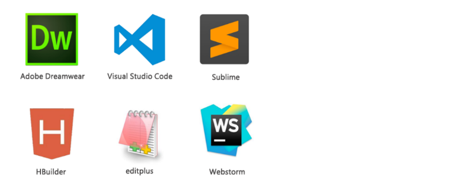
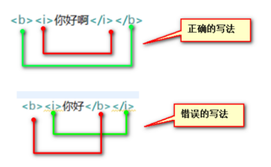
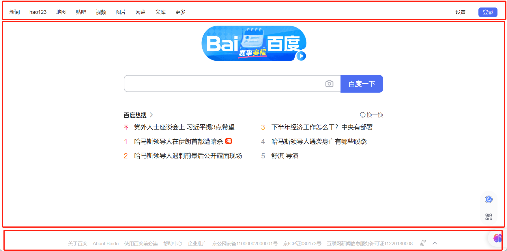
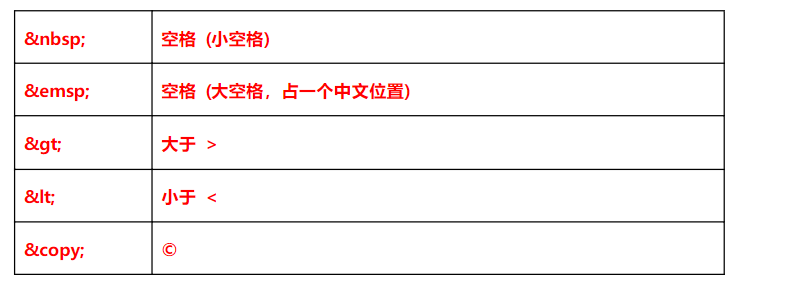

# 1、课程介绍

主要掌握HTML常用标签，能够灵活使用这些标签编写简单的网页

# 2、HTML介绍

## 2.1、什么是HTML?

我们可以在浏览器里打开任意一个网站页面，它就是一个HTML，当然你所见到的网页都离不开HTML，作为专业的前端工程师，HTML是必学的技能之一，那么我先来认识一下它。

HTML 指的是**超文本标记语言** (Hyper Text Markup Language)
**语  言**：人们用于交流的工具，计算机语言是人与计算机交流的工具。
**超文本**：就是指页面内可以包含图片、链接，甚至音乐、视频等非文字元素。
**标  记**：一种标记符，可以告诉浏览器如何显示其中的内容。

比如：`<b>加粗效果</b>`，`<b></b>`就是一种标记符。

**注意事项：**
HTML 不是一种编程语言（HTML没有变量、流程等），它是一种标记语言。
标记语言是一套标记标签，例如：`<b>字体加粗了</b><i>字体变倾斜了</i>`。
HTML 使用标记标签来描述网页内容。

## 2.2、为什么要使用HTML？

因为HTML是一种标记语言，主要用于描述网页内容，告诉浏览器跟据我们的标记符的类型，显示相应的内容。HTML就像是我们的饭碗一样，如果吃饭这个只少也要算个标配吧！当然，对于我们的网站，HTML就是整个网站的骨架，如果不用HTML，我们很难想像网站长什么样子。所以这些基础知识我们必需掌握。

## 2.3、在哪里使用HTML？

HTML使用的地方非常的广泛，基于浏览器端所有能看到的网站都用到它。
比如说：京东、淘宝

## 2.4、HTML的发展历程

超文本标记语言（第一版 HTML1.0）——在1993年6月作为互联网工程工作小组（IETF）工作草案发布（并非标准）：
HTML 2.0——1995年11月发布，于2000年6月发布之后被宣布已经过时
HTML 3.2——1997年1月14日，W3C推荐标准
HTML 4.0——1997年12月18日，W3C推荐标准
**HTML 4.01——1999年12月24日，W3C推荐标准**

XHTML1.0——发布于2000年1月26日，是W3C推荐标准，推出的目的是为了更好的规范HTML语法，与HTML4.01几乎一模一样。(让HTML语法更严谨)
XHTML 1.1，于2001年5月31日发布，W3C推荐标准。

**HTML 5——2014年10月29日，万维网联盟宣布，经过接近8年的艰苦努力，该标准规范终于制定完成。保留HTML4所有功能，增加很多新的功能。**

总结：
1.HTML 4.01是最经典的HTML版本
2.XHTML在PC上使用率高
3.HTML5是最新的HTML版本，最前沿，新开发的网站几乎都是采用此版本。
**W3C：万维网联盟，是Web技术领域最具权威和影响力的国际中立性技术标准机构，该组织制定Web技术标准。**

# 3、前端开发工具（了解）

俗话说“工欲善其事，必先利其器”，作为一名专业级的前端开发工程师来说，开发工具是必不可少的一部分，一款顺手的工具，能让工作变得更轻松，效率更高！但是记住，所有的工具只是拿来辅助的，不要产生太多的依赖，对于初学者来说，代码必需多敲。先来看看作为前端需要两大法宝吧！

## 3.1、HTML开发工具

可以用来写HTML编辑器有很多，甚至可以使用记事本来编辑，那作为专业的WEB前端工程师应该选用哪一款呢？我们首来看一下常见的编辑器：

Dreamwear：Adobe的一款可视化开发网页的软件
**HBuilder：强力的前端开发工具**
EditPLUS：简单便捷的轻型编辑软件
NotePad++：轻量级多国语言编辑器
Sublime：提示功能比较强大(轻，小，需要安装插件)
Vi / Vim ：Linux 系统上的最著名的文本/代码编辑器
**VScode：强大的提示和高亮及emmet语法,让写代码更快捷**
**Webstorm：被誉为“Web前端开发神器”、“最智能的JavaScript IDE”**
记事本：用来装逼的
任意一个文本工具都可以开发 HTML，我们建议使用 VScode、Webstorm、HBuilder

## 3.2、浏览器的认识

常见的网页浏览器有：IE、Firefox、Safari（苹果电脑）、Opera、Google Chrome、百度浏览器、搜狗浏览器、猎豹浏览器、360浏览器、UC浏览器、傲游浏览器、世界之窗浏览器等，浏览器是最经常使用到的客户端程序。

对于开发者而言，Firefox和Chrome是不错的选择，因为它们有强大开发者功能，**前端调试样式和JavaScript，强力推荐Chrome** 。

## 3.3、BS与CS架构

"BS" 和 "CS" 架构通常指的是两种不同的软件系统架构模型。

它们分别代表  **Browser/Server（浏览器/服务器）**架构和  **Client/Server（客户端/服务器）**架构。

### 3.3.1、CS架构

在 CS 架构中，客户端（Client）应用程序安装在用户的计算机上，并通过网络与一个或多个服务器（Server）进行通信。客户端负责用户界面和部分业务逻辑处理，而服务器端则主要处理数据存储、管理和复杂的业务逻辑。这种架构的特点包括：

- 客户端需要预先安装特定的应用程序。
- 客户端应用可能需要定期更新。
- 适用于固定用户群且对安全性要求较高的场景。

### 3.3.2、BS架构

BS 架构是基于 Web 的应用架构，其中客户端仅需要一个现代的 Web 浏览器即可访问服务器上的应用程序。在这种架构下：

- 用户通过浏览器与服务器交互，无需在本地安装任何特殊软件。
- 服务器提供动态生成的网页或 Web 应用程序。
- 维护和升级更容易，因为只需要更新服务器端的应用程序。
- 适用于广泛的用户群体，特别是那些需要从不同设备访问应用的情况。

### 3.3.3、对比

- **部署和维护**：BS 架构更容易部署和维护，因为所有的工作都在服务器端完成，而 CS 架构可能需要在每个客户端上进行更新。
- **性能**：CS 架构可以利用客户端的计算资源，因此在某些情况下可能会有更好的性能。
- **安全性**：CS 架构由于其封闭性，在某些方面可能更安全，但 BS 架构可以通过各种安全措施来加强安全性。
- **可访问性**：BS 架构允许用户从任何地方使用任何设备访问应用程序，而 CS 架构通常需要特定的客户端软件。

根据应用场景的不同，可以选择适合的架构来满足需求。随着云计算和移动互联网的发展，BS 架构变得越来越流行，因为它提供了更好的灵活性和可扩展性。

# 4、HTML入门（掌握）

## 4.1、如何编写一个最简单的HTML文件

1）新建一个文本文档
2）将后缀名改为.html（.htm）
3）就可以在里面开始写HTML代码了

~~~html
<b>好好学习，天天向上</b>
<h1>好好学习，天天向上</h1>
~~~

4）点击文件，使用浏览器打开查看效果

## 4.2、HTML语法

HTML属于解释执行性语言，HTML文件，不需要经过编译，就可以直接交给浏览器，浏览器会自动的去解析HTML文件中的标记，然后将其按照特定的规则渲染出来。

### 4.2.1、HTML文件格式

一般我们写的代码需要存储在文件中，HTML代码一般保存在后缀名为 **.html 或 .htm** 文件中。

比如  index.html   或者  index.htm ，所以为了让大家知道你文件中是什么内容，我们编写一个HTML网页时文件名的后缀为html或htm，建议使用 .html。

**注意：**
**Win7操作：**如果你的电脑没有显示扩展名，打开任一一个盘符：找到**工具**-->**选项**-->**查看**-->**高级选项**-->**已知隐藏文件类型扩展名**前面的沟去掉

**Win10操作：**打开任一一个盘符：**查看**-->**文件扩展名**勾选上

**Win11操作：**打开任一一个盘符：**查看**-->**显示**-->**文件扩展名**  勾选上

### 4.2.2、HTML标签格式

**1、什么是 HTML 标签？**
HTML标记标签也称为HTML标签(HTML tag)，由开始标签和结束标签组成，用于表现结构化的内容，将内容构造成为一个完整的网页。

**开始标签**是被**尖括号包围**的**元素名**。
**结束标签**是被**尖括号包围**的**斜杠**和**元素名**。

~~~html
<元素名>内容< /元素名>
~~~

例如：`<h1>文本内容</h1>   <b></b>`

**2、单标签与双标签**

通常情况下，在我们的HTML中，标签分为两大类：

**1） 双标签**
双标签是指由**开始标签**和**结束标签**组成
例如：`<b>内容</b>`

**2） 单标签**
单标签是指**没有结束标签的标签**，由一个标签构成即为开始也是结束
但根据XHTML的规范，标签一定要有结束，于是写上自结束符号： /
例如：`
   `

注意：有些 HTML 元素没有结束标签，比如`  `

**3、标签属性**
定义：**属性**主要用于**设置标签**的更多**细节信息**
比如字体标签``，如果需要设置字体大小，我们就需要使用size属性

基本语法：`<标签名 属性名="属性值" 属性名="属性值" ....>`

~~~html
 <!-- 设置字体的标签 -->
好好学习，天天向上
~~~

**注意事项：**
1.属性一般写在开始标签上
2.属性总是以名称/值对的形式存在（简称：名值对）
3.属性的值建议大家使用双引号（可以加双引号，也可以加单引号，也可以不加引号；千万不要在一个值又加单引号又加双引）

4、通用属性
HTML 标签拥有通用属性，也就是每个标签都有属性（有个别例外）。
Base，head，html，meta，script，style，title标签不提供下面的属性：

| **属性** | **值**                   | **描述**               |
| -------- | ------------------------ | ---------------------- |
| class    | class_rule 或 style_rule | 元素的类(class)        |
| id       | id_name                  | 元素的某个特定id       |
| style    | 样式定义                 | 内联样式定义           |
| title    | 提示文本                 | 显示于提示工具中的文本 |

## 4.3、HTML基本结构

~~~html
<!DOCTYPE html>
<html>
	<head></head>
	<body></body>
</html>
~~~

> DOCTYPE: 文档声明
>
> html: 标签告知浏览器其自身是一个 HTML 文档
>
> head: 标签用于定义文档的头部（文档的描述信息）
>
> body: 标签用于定义文档的主体（文档的主体内容）

## 4.4、HTML基本结构认识

~~~html
<!-- 
文档声明：位于文档的首行，告知浏览器文档使用哪种 HTML 或 XHTML 规范。让浏览器通过正确的方式解析我们的网页，使网页能正常显示。 
-->
<!DOCTYPE html>
<!-- html标签：告诉页面这是一个HTML文档 
	lang:表示规则元素内容语言（了解）
	属性的值：
	en:表示英文
	zh:表示简体中文
-->
<html lang="en">
<!-- 
    head标签:就是一个网页的头,头部中的内容一般存放描述文档的信息。
-->
<head>
<!--
	meta元素可提供有关页面的元信息，比如针对搜索引擎和更新频度的描述和关键词等。
    声明文件的编码是UTF-8的编码，告诉浏览器，你用什么编码去解析这个文件
        UTF-8 : 国际通用码
        GBK/GB2312 : 中文编码
        这里的编码必需要和文件的编码完全一致
-->
<meta charset="UTF-8" />
<!-- 
	viewport：表示视区
	initial-scale：初始缩放比例，也即是当页面第一次 load 的时候缩放比例
-->
<meta name="viewport" content="width=device-width, initial-scale=1.0">
<!-- 兼容IE浏览器 -->
<meta http-equiv="X-UA-Compatible" content="ie=edge">
<!-- 提供给搜索引擎的关键字信息 -->
<meta name="keywords" content="中国第一门户网站" />
<meta name="description" content="代表中国，代表最牛的技术，代表互联网时代" />
<!--title : 网页的标题，会显示在标题栏-->
<title>我是网页的标题</title>
</head>
<!-- 
    body标签:就是一个身体
        一般来说:body里面的内容要显示出来
-->
<body>
我是未来中国最牛逼的IT从业者
</body>
</html>
~~~

## 4.5、HTML注释

语法：**<!-- 注释内容 -->** 

含义：注释标签用来在源文档中插入注释。注释会被浏览器忽略。您可使用注释对您的代码进行解释，这样做有助于您在以后的时间对代码的理解。

> 注意：注释不能嵌套
>
> <!-- 注释
>
> ​			<!-- 注释 --> 
>
> ​			注释嵌套是错误的
>
>  --> 

## 4.6、HTML编码

常见的编码格式有： 

| UTF-8      | 国际通用编码字符集，UNICODE的灵活版  |
| ---------- | ------------------------------------ |
| GBK/GB2312 | 中文编码字符集                       |
| BIG5       | 中文繁体字符集                       |
| iso8859-1  | 西方欧洲语言字符集，通常叫做Latin-1  |
| UNICODE    | 大字符集，包含了地球上所有语言的编码 |

> HTML的编码声明为：` <meta charset="utf-8"/>`
>
> 文件编码是指HTML文件保存到硬盘中的编码格式，一般在保存的时候设置，常见的开发工具都可在编辑的时候设置。
>
> 注意：2个地方必须保持一致（文件编码+HTML编码声明）

## 4.7、HTML的规范

* 所有的HTML标签都必需**使用尖括号包裹起来**，比如： <html>
* HTML标签通常是成对出现的，双标签**必需要有开始标签和结束标签**，比如：`<b>和</b>`
* HTML标签不区分大小写（**建议都使用小写**，可读性更高）
* 所有HTML双标签都**可以是进行嵌套，但是不允许交叉嵌套**

# 5、HTML基本标签（掌握）

## 5.1、基础标签

### 5.1.1、标题标签

hn标签不是一个标签，而是一组标签的缩写：h1  h2  h3  h4  h5  h6

**定义和用法：<h1> - <h6> 标签可定义标题，<h1> 定义最大的标题，<h6> 定义最小的标题。**

由于 h 元素拥有确切的语义，因此请您慎重地选择恰当的标签层级来构建文档的结构。因此，请不要利用标题标签来改变同一行中的字体大小。以后将使用CSS样式来制作效果。

~~~html
<!DOCTYPE html>
<html lang="en">
<head>
    <meta charset="UTF-8">
    <meta http-equiv="X-UA-Compatible" content="IE=edge">
    <meta name="viewport" content="width=device-width, initial-scale=1.0">
    <title>Document</title>
</head>
<body>
    <!-- 
        标题标签:
            h1~h6:
            一般页面上使用的h1~h4较多，通过以h2和h3为主

        快速复制的快捷键：
            shift + alt + ↓或↑   
        删除光标所在的行
            ctrl + shift + k
    -->
    <h1>今天有一件大事要发生了~~~~</h1>
    <h2>今天有一件大事要发生了~~~~</h2>
    <h3>今天有一件大事要发生了~~~~</h3>
    <h4>今天有一件大事要发生了~~~~</h4>
    <h5>今天有一件大事要发生了~~~~</h5>
    <h6>今天有一件大事要发生了~~~~</h6>
    
    今天有一件大事要发生了~~~~
</body>
</html>
~~~

### 5.1.2、p标签

**定义和用法：
 标签定义段落。**

p 元素会自动在其前后创建一些空白（段间距）。浏览器会自动添加这些空间，您也可以在样式表中规定。

以下代码标记了一个段落：

~~~html
    <!-- 
        段落标签：p
     -->
    
作为一个普通人，如果您没有在瑞士信贷银行存钱，那么您个人的利益应该不会受到直接影响。然而，这样的事件可能会对整个金融市场和经济产生一定的冲击和波动，可能会导致股市、汇市等的变化，因此可能间接地对您造成一定的影响。最好的做法是保持警惕，并及时关注相关新闻和市场动态。

    
从事件广泛影响来看，瑞信风波可能会影响整个金融体系的信用评级，导致公司、国家等重点主体的信用评级下调，增加金融系统的债务成本。微观来讲可能导致资金流向变化，增加货币贬值风险，对经济长期增长产生不利影响。继而投资者对整个金融市场的信任度下降，对于投资市场的长期发展产生不利影响。尤其会引起金融监管机构的更严厉的监管措施，减少金融机构的杠杆率，导致金融机构运营效率下降。

    
从事件广泛影响来看，瑞信风波可能会影响整个金融体系的信用评级，导致公司、国家等重点主体的信用评级下调，增加金融系统的债务成本。微观来讲可能导致资金流向变化，增加货币贬值风险，对经济长期增长产生不利影响。继而投资者对整个金融市场的信任度下降，对于投资市场的长期发展产生不利影响。尤其会引起金融监管机构的更严厉的监管措施，减少金融机构的杠杆率，导致金融机构运营效率下降。

~~~

### 5.1.3、换行标签

**定义和用法 ： ` `可插入一个简单的换行符。**

` ` 标签是单标签（意味着它没有结束标签，因此这是错误的：`  `）。在 XHTML 中规定单标签也需要结束，把结束标签放在开始标签中，也就是`  `。

注意：` ` 标签只是简单地开始新的一行，而当浏览器遇到 
 标签时，通常会在相邻的段落之间插入一些垂直的间距。而br 则不会。

~~~html
<!DOCTYPE html>
<html lang="en">
<head>
    <meta charset="UTF-8">
    <meta http-equiv="X-UA-Compatible" content="IE=edge">
    <meta name="viewport" content="width=device-width, initial-scale=1.0">
    <title>Document</title>
</head>
<body>
    好好学习 
       
    天天向上
</body>
</html>
~~~

### 5.1.4、水平分割线

定义和用法：`
` 标签在 HTML 页面中创建一条水平线。

水平分隔线（horizontal rule）可以在视觉上将文档分隔成各个部分。

被水平线分隔的标题和段落：

~~~html
<h1>这是大标题</h1>

这是一个段落

~~~

## 5.2、文本标签

### 5.2.1、加粗标签

b和strong标签，用于页面上的某些文本数据加粗，后期如果需要，建议使用strong

~~~html
 
超级文本<b>标记语言</b>是标准通用标记语言下<strong>的一个应用</strong>，也是一种规范，一种标准，它通过标记符号来标记要显示的网页中的各个部分。

~~~

### 5.2.2、倾斜（斜体）标签

定义和用法 : <i> <em> 标签告诉浏览器把其中的文本表示为强调的内容。对于所有浏览器来说，这意味着要把这段文字用斜体来显示。

在文本中加入强调也需要有技巧。如果强调太多，有些重要的短语就会被漏掉；如果强调太少，就无法真正突出重要的部分。这与调味品一样，最好还是不要滥用强调。
**注意： HTML5中建议使用 <em> 而不使用 <i>**

### 5.2.3、变大或变小标签

变大：big，

变小：small

~~~html
<small>且不停止其</small>解释执行过程，<big>编制者</big>只能通过显示效
~~~

## 5.3、超链接标签

超链接：主要功能完成页面上的点击跳转。

~~~html
<a href="https://www.baidu.com">百度</a>
~~~

根据跳转的目标（地址）不同，超链接可以分为：外部链接、内部链接、锚点(哈希hash)链接

### 5.3.1-外部链接

通过超链接a标签，可以跳转到当前页面（项目）之外的其他的网站，称为外部链接

~~~html
<a href="https://www.baidu.com/">百度</a>
<a href="https://www.jd.com/">京东</a>
<a href="https://www.taobao.com/">淘宝</a>
~~~

> 在a标签的href属性上，书写的时候，跳转外部地址的时候，需要书写完整的地址   协议://网址
>
> 协议：https:   、 http:  、 ftp:   、 thunder:（迅雷自己的协议）    

关于a标签有两个重要的属性：

* href：用于书写跳转的地址
* target：用于书写以什么方式打开的新页面
  * _self : 默认值，在当前窗口打开
  * _blank : 在一个新窗口中打开

~~~html
<a href="https://www.jd.com/" target="_blank">京东</a>
<a href="https://www.taobao.com/" target="_self">淘宝</a>
~~~

### 5.3.2-内部链接

在同一个项目（网站）中进行各个页面之间的跳转，称为内部链接。

~~~html
<!-- 
内部链接：a标签
    内部链接跳转的地址，不需要书写协议，直接书写跳转的地址即可
    地址书写有两种方式：
        相对路径：
        绝对路径：
-->
<a href="./02-认识超链接.html" target="_blank">认识超链接</a> 
<a href="./01-语义化标签.html" target="_blank">语义化</a> 
<a href="./day01/06.html" target="_blank">作业6</a> 
~~~

### 5.3.3-锚点链接

锚点链接：在同一个页面上，点击链接，可以跳转到当前页面的其他位置。

一般页面上需要锚点链接的时候，页面内容非常的多，让用户直接去拖拽滚动条很不方便，因此可以给出一些快捷的跳转链接，用户点击链接直接切到当前页面的对应位置。

> 锚点链接书写的时候需要注意：
>
> 1、使用a标签，书写跳转的地址，需要使用#加锚点的id属性值
>
> 2、需要使用任意的一个标签，在页面不同位置去定义锚点，标签上一般建议使用id属性去给锚点命名·

~~~html
    
页面顶部

    <a href="#inter">国际新闻</a>
    <a href="#country">国内新闻</a>
    <a href="#jie">班导</a>
    <a href="#feng">峰哥</a>
    <a href="#yang">阳哥</a>
                        
    
国际新闻

                        
                        
    
国内新闻

                        
                        
    
班主任花边新闻

                        
                        
    
峰哥故事

                        
                        
    
阳彬履历

                        
                        
    <a href="#top">顶部</a>
~~~

## 5.4、多媒体标签

多媒体：通过不同的标签，可以将图片、视频、音频放到页面上。

### 5.4.1-图片标签【重点】

  img:图片标签,单标签, 将图片显示在页面上

​      src: 用于书写图片的路径（书写项目中的图片路径，也可以书写网络中的在线图片地址）  

​      alt: 当图片加载失败，无法显示的时候，浏览器会显示提示信息

​      title: 鼠标悬停在图片上的提示信息

​      width ： 设置图片的宽度

​      height ： 设置图片的高度

​      border ： 图片设置边框      

​    img设置页面上的图片，要么设置宽度，要么设置高度 ，另外一个值浏览器会根据图片的原始大小进行等比例缩放

​    图片的扩展名：jpg、jpeg、png、gif、svg、webp   

~~~html
<!DOCTYPE html>
<html lang="en">
<head>
    <meta charset="UTF-8">
    <meta http-equiv="X-UA-Compatible" content="IE=edge">
    <meta name="viewport" content="width=device-width, initial-scale=1.0">
    <title>Document</title>
</head>
<body>
     
    
    
</body>
</html>
~~~

### 5.4.2-video标签

  video : 视频标签

​      src：书写视频文件的路径（本地、在线）

​      controls:用于控制播放器上的控制按钮

​      autoplay：自动播放

​      muted：静音

​      loop：单个视频循环播放

​    针对音视频标签，即使添加 autoplay 属性，默认也不会自动播放，主要是浏览器对用户的保护

~~~html
<!DOCTYPE html>
<html lang="en">
<head>
    <meta charset="UTF-8">
    <meta http-equiv="X-UA-Compatible" content="IE=edge">
    <meta name="viewport" content="width=device-width, initial-scale=1.0">
    <title>Document</title>
</head>
<body>
    <video width="500" height="400" controls="controls" autoplay muted loop src="https://v2.kwaicdn.com/upic/2023/02/05/18/BMjAyMzAyMDUxODE5MzlfMjcwNTU4NTYwOF85NTUyOTkyOTc4M18xXzM=_hd15_B6eb6f24c42a96fa7578b54378df3ecf8.mp4?pkey=AAUliwtHICx8mpb6kfg460Adb4vIMhwvs8QfKj7wYBAB0b5JcfBC8r2ooYKo84xzVpV_zV3tK5n4TPJsu5pX3beDy8SvHW2dEkm6Db8yyUj5kjJOMS3ZE5h7TZ6lIoTTVNE&tag=1-1679036723-unknown-0-qkiyfeixtz-b3f32b970b7fa1b9&clientCacheKey=3xc8aak4gbszv6q_hd15.mp4&di=af0bbda2&bp=14944&tt=hd15&ss=vp"></video> 
    <video src="./imgs/1.mp4" controls></video>
</body>
</html>
~~~

### 5.4.3-audio标签

​    audio : 音频标签

​      src : 书写音频文件的地址（在线，离线）

​      controls ：显示控制按钮

​      autoplay ：自动播放，默认不是不会自动播放

​      muted ： 静音

​      loop ： 循环播放

~~~html
 <audio src="./imgs/beyond.mp3" controls autoplay muted loop></audio>
~~~

## 5.5、路径问题

在页面上a标签(href) 、img标签(src)  、 video或audio(src)  这几个标签在页面上出现的时候，都需要书写资源的地址，针对地址书写分为两种情况：

* 相对地址（路径）：需要一个参照物，当前写代码的哪个文件（html文件，后续还会有css文件）。

  * 当前目录：`./`   当前目录   (./是可以省略)
  * 当前目录下有其他文件夹 :   `./文件夹名/文件夹名/文件名`
  * 在当前文件所在的父目录：`../文件夹名/文件名`
  * 多级父目录中：`../../退出多级之后，直到找到位置为止`

  ~~~html
      <!-- 当前目录下，找到imgs文件夹中的3.webp图片 -->
      
      <!-- 从的当前的目录出去，找到aaa文件夹中的2.webp -->
      
      <!-- 在当前目录直接找到2.webp -->
      
      
      
  ~~~

* 绝对地址（路径）：绝对路径，不管当前文件的位置再哪里，书写出来基本一致。

  * 以协议开始：https://  、 http://  、 ftp://
  * 以磁盘的根目录开始：c://   这种方式仅限于开发测试，上线不允许写
  * 以 `/`  开始书写 的路径 ： 
    * 如果当前html是以file方式打开：`/`  表示html所在的盘符
    * 如果html放在服务器上，这是代码的是域名之后的根目录

## 5.6、列表标签

列表：页面上有多组（个）相同的格式内容，放在一起，组成一列。称为一个列表

html中的列表有三种：无序列表（重点）、有序列表、自定义列表

### 5.6.1-无序列表【重点】

无序列表它是一组标签：ul与li组合

ul书写列表的范围，li书写列表中的每一项，在页面上，ul中只能书写li，li标签中可以书写其他标签

ul标签上可以书写type属性，来修改li前面默认的无序的符号（disc  square  circle ）

~~~html
<ul type="circle">
    <li>新闻1</li>
    <li>新闻2</li>
    <li>新闻3</li>
    <li>新闻4</li>
    <li>新闻5</li>
</ul> 
~~~

### 5.6.2-有序列表

有序列表也是一组标签：ol与li组合 ， ol中也只能书写li，li中可以书写其他标签

~~~html
<ol type="I">
    <li>唱歌</li>
    <li>跳舞</li>
    <li>rap</li>
    <li>篮球</li>
    <li>广场舞</li>
</ol>
~~~

### 5.6.3-自定义列表

自定义列表：dl与dt和dd组成，dl中可以出现dt或dd，不能出现dt与dd之外的其他标签，dt与dd中可以书写其他标签

~~~html
<dl>
    <dt>爱好：</dt>
    <dd>爬山</dd>
    <dd>游泳</dd>
    <dd>打球</dd>

    <dt>技能：</dt>
    <dd>吹</dd>
    <dd>拉</dd>
    <dd>弹</dd>
    <dd>唱</dd>
</dl>
~~~

## 5.7、table表格

### 5.7.1- 简单的表格

一个表格由若干部分组成：

* 表格整体：table标签
* 表格行：tr标签
* 表格单元格：td标签

~~~html
<!DOCTYPE html>
<html lang="en">
<head>
    <meta charset="UTF-8">
    <meta http-equiv="X-UA-Compatible" content="IE=edge">
    <meta name="viewport" content="width=device-width, initial-scale=1.0">
    <title>Document</title>
    
</head>
<body>
    <!-- 简单的表格 -->
    <table>  <!-- 表格的整体 -->
        <tr>   <!-- 表格的行 -->
            <td>这是一个简单的表格</td>  <!-- 表格的单元格，真正存放表格的数据的标签 -->
            <td>这是一个简单的表格</td>
            <td>这是一个简单的表格</td>
            <td>这是一个简单的表格</td>
            <td>这是一个简单的表格</td>
        </tr>
    </table>
     
    

    <!-- 书写一个人员信息的表格 -->
    <table>
        <tr>
            <td>姓名</td>
            <td>年龄</td>
            <td>性别</td>
            <td>住址</td>
            <td>电话</td>
        </tr>
        <tr>
            <td>夏云皓</td>
            <td>18</td>
            <td>女</td>
            <td>东莞</td>
            <td>10086</td>
        </tr>
        <tr>
            <td>毛珊</td>
            <td>女</td>
            <td>16</td>
            <td>岳麓区</td>
            <td>10010</td>
        </tr>
        <tr>
            <td>李均</td>
            <td>女</td>
            <td>16</td>
            <td>岳麓区</td>
            <td>10010</td>
        </tr>
        <tr>
            <td>黄河</td>
            <td>男</td>
            <td>20</td>
            <td>玉兰路</td>
            <td>12123</td>
        </tr>
    </table>
</body>
</html>
~~~

### 5.7.2-完整表格

**完整表格的标签：table > caption | thead | tbody | tfoot > tr > td | th**

table(表格整体)   

​	caption(表格的标题)

​	thead(表格头部)

​	tbody(表格身体，表格数据区域)

​	tfoot(表格的尾部)

​		tr(表格的行)

​			th或td(单元格)

~~~html
<!DOCTYPE html>
<html lang="en">
<head>
    <meta charset="UTF-8">
    <meta http-equiv="X-UA-Compatible" content="IE=edge">
    <meta name="viewport" content="width=device-width, initial-scale=1.0">
    <title>Document</title>
    
</head>
<body>
    <!-- 
        完整的表格：
            table：标签
                caption:表格的标题
                thead:表格的头部
                tbody:表格身体（内容区域） 
                tfoot:表格的尾部
                    tr 表格的行
                        td或者th 表格单元格
     -->
    <table>
        <caption>人员信息表</caption>
        <thead>
            <tr>
                <th>姓名</th>
                <th>年龄</th>
                <th>性别</th>
                <th>住址</th>
                <th>电话</th>
            </tr>
        </thead>
        <tbody>
            <tr>
                <td>夏云皓</td>
                <td>18</td>
                <td>女</td>
                <td>东莞</td>
                <td>10086</td>
            </tr>
            <tr>
                <td>毛珊</td>
                <td>女</td>
                <td>16</td>
                <td>岳麓区</td>
                <td>10010</td>
            </tr>
            <tr>
                <td>李均</td>
                <td>女</td>
                <td>16</td>
                <td>岳麓区</td>
                <td>10010</td>
            </tr>
            <tr>
                <td>黄河</td>
                <td>男</td>
                <td>20</td>
                <td>玉兰路</td>
                <td>12123</td>
            </tr>
        </tbody>
        <tfoot>
            <tr>
                <td>统计：</td>
                <td>5人</td>
            </tr>
        </tfoot>
    </table> 
</body>
</html>
~~~

### 5.7.3-表格隔行变色与鼠标移入高亮(了解)

> 补充伪类选择器：
>
> :first-child: 必须是父标签中的第一个位置上的标签
>
> :last-child: 必须是父标签中的最后一个位置上的标签
>
> ~~~html
> <!DOCTYPE html>
> <html lang="en">
> <head>
>  <meta charset="UTF-8">
>  <meta http-equiv="X-UA-Compatible" content="IE=edge">
>  <meta name="viewport" content="width=device-width, initial-scale=1.0">
>  <title>Document</title>
>  
> </head>
> <body>
>  

>      11111
>      22222
>      <a href="#">百度云</a>
>      <a href="#">腾讯</a>
>      <a href="#">京东</a>
>  

> </body>
> </html>
> ~~~
>
> :nth-child( 数字 | 公式 ): 选中父标签中指定的位置上的标签，或者符合公式的标签

~~~html
<!DOCTYPE html>
<html lang="en">
<head>
    <meta charset="UTF-8">
    <meta http-equiv="X-UA-Compatible" content="IE=edge">
    <meta name="viewport" content="width=device-width, initial-scale=1.0">
    <title>Document</title>
    
</head>
<body>
    <table>
        <tr>
            <td>姓名</td>
            <td>年龄</td>
            <td>性别</td>
            <td>住址</td>
            <td>电话</td>
        </tr>
        <tr>
            <td>夏云皓</td>
            <td>18</td>
            <td>女</td>
            <td>东莞</td>
            <td>10086</td>
        </tr>
        <tr>
            <td>毛珊</td>
            <td>女</td>
            <td>16</td>
            <td>岳麓区</td>
            <td>10010</td>
        </tr>
        <tr>
            <td>李均</td>
            <td>女</td>
            <td>16</td>
            <td>岳麓区</td>
            <td>10010</td>
        </tr>
        <tr>
            <td>黄河</td>
            <td>男</td>
            <td>20</td>
            <td>玉兰路</td>
            <td>12123</td>
        </tr>
    </table>
</body>
</html>
~~~

### 5.7.4-表格行或列合并

表格行或列合并：跨行或跨列的表格，制作这种表格，先书写一个完整的表格，然后找到对应的单元格，查阅UI设计图，判断当前需要合并行，还是合并列，最终将多余的单元格删除。

* 合并行（跨行）表格：找到需要合并的单元格，使用rowspan属性，设置合并的行数（包含当前这个单元格）

  ~~~html
  <td rowspan="3">男</td>  当前的单元格需要合并三行（跨越3行）
  ~~~

* 合并列（跨列）表格：找到需要合并的单元格，使用colspan属性，设置合并的列数（包含当前这个单元格）

  ~~~html
  <td colspan="3">4人</td>
  ~~~

~~~html
<!DOCTYPE html>
<html lang="en">
<head>
    <meta charset="UTF-8">
    <meta http-equiv="X-UA-Compatible" content="IE=edge">
    <meta name="viewport" content="width=device-width, initial-scale=1.0">
    <title>Document</title>
    
</head>
<body>
    <table>
        <tr>
            <td>姓名</td>
            <td>年龄</td>
            <td>性别</td>
            <td>成绩</td>
        </tr>
        <tr>
            <td>曹智根</td>
            <td>18</td>
            <td>不详</td>
            <td>88</td>
        </tr>
        <tr>
            <td>刘兴颖</td>
            <td>20</td>
            <td rowspan="3">男</td>
            <td>100</td>
        </tr>
        <tr>
            <td>周美</td>
            <td>20</td>
            <!-- <td>男</td> -->
            <td>100</td>
        </tr>
        <tr>
            <td>姜子浩</td>
            <td>22</td>
            <!-- <td>男</td> -->
            <td>80</td>
        </tr>
        <tr>
            <td>统计</td>
            <td colspan="3">4人</td>
            <!-- <td></td>
            <td></td> -->
        </tr>
    </table>
    
</body>
</html>
~~~

### 5.7.5-表格总结：

**简单表格：table  >  tr  > td**

完整表格：table > caption | thead | tbody | tfoot > tr > td | th

跨行：rowspan="跨越的行数"

跨列：colspan="跨越的列数"

基于表格的css样式：**border-collapse: collapse**;  合并表格边框线（细边框表格）

## 5.8、表单标签

### 5.8.1-表单标签作用

表单标签：它主要用于在页面上收集(用户)数据，并且可以将数据最终提交给后端程序。

表单标签：它也是一组标签，不是一个标签。

* 表单标签：form
* 表单项标签：input(输入项)、select(下拉框)、多行文本域(textarea)
* 表单按钮：button

### 5.8.2-表单标签form

~~~html
form标签：表示标签整体
    action属性：用来书写数据最终给哪里提交（后端给出的地址）
    method属性：以什么方式将数据提交给action所指的后端程序
    	get方式：默认值，数据提交的时候会在action的地址后面使用?隔开，拼接提交的数据
    		https://www.baidu.com/s?ie=utf-8&wd=孟子
		post方式：提交的数据会被隐藏起来
    enctype属性：提交的数据，采用的编码格式
        application/x-www-form-urlencoded：普通表单（默认值）
        multipart/form-data ： 提交的表单中，还有文件上传数据
        text/plain : 普通文本数据
~~~

### 5.8.3-常用的表单项

~~~html
表单项介绍：
	input标签：它是一个单标签，同时是一个行内标签
        type属性：
        <input type="text"> 单行文本框（输入框）
        <input type="password">  密码框（掩码）
        <input type="radio">  单选按钮
        <input type="checkbox"> 复选（多选）按钮
        <input type="submit"> 提交按钮
        <input type="reset"> 重置按钮
        <input type="button"> 普通按钮

	select标签：它是下拉框，需要配合option标签完成
		每个option标签，是select中的一个下拉项
	textarea标签：文本域（多行文本框）
~~~

~~~html
<!DOCTYPE html>
<html lang="en">
<head>
    <meta charset="UTF-8">
    <meta http-equiv="X-UA-Compatible" content="IE=edge">
    <meta name="viewport" content="width=device-width, initial-scale=1.0">
    <title>Document</title>
</head>
<body>
    <!-- 
        表单项介绍：
            input标签：它是一个单标签，同时是一个行内标签
                type属性：
                    <input type="text"> 单行文本框（输入框）
                    <input type="password">  密码框（掩码）
                    <input type="radio">  单选按钮
                    <input type="checkbox"> 复选（多选）按钮
                    <input type="submit"> 提交按钮
                    <input type="reset"> 重置按钮
                    <input type="button"> 普通按钮
            
            select标签：它是下拉框，需要配合option标签完成
                每个option标签，是select中的一个下拉项
            
            textarea标签：文本域（多行文本框）

    -->
    <form action="">
        

            账号：<input type="text">
        

        

            密码：<input type="password">
        

        

            性别：
            <input type="radio">男
            <input type="radio">女
        

        

            爱好：
            <input type="checkbox">琴
            <input type="checkbox">棋
            <input type="checkbox">书
            <input type="checkbox">画
        

        

            选择地址：
            <select>
                <option>-请选择-</option>
                <option>北京</option>
                <option>天津</option>
                <option>西安</option>
                <option>上海</option>
            </select>
        

        

            <textarea cols="30" rows="3"></textarea>
        

        

            <input type="submit">
            <input type="reset">
            <input type="button" value="普通按钮">
        

    </form>
</body>
</html>
~~~

### 5.8.4-表单的细节【理解】

~~~html
表单的细节：
1、一般要求每个表单项上都必须添加name属性，用于提交数据
    将neme属性的值与用户输入的值，拼成 name属性值=输入的值
    例如：<input type="text" name="account">

    提交后：account=abc

2、针对单选按钮，必须添加name属性，name属性值一样的，它们才是一组，才能保证为单选

3、针对页面上的表单项是让用户选择的，不是用户输入的，必须书写value属性，

4、针对下拉框，name属性需要书写在select标签上，而value需要书写在每个option标签上，
	如果option上没有书写value属性，默认使用option中的文本数据
~~~

~~~html
<!DOCTYPE html>
<html lang="en">
<head>
    <meta charset="UTF-8">
    <meta http-equiv="X-UA-Compatible" content="IE=edge">
    <meta name="viewport" content="width=device-width, initial-scale=1.0">
    <title>Document</title>
</head>
<body>
    <form action="">
        

            账号：<input type="text" name="account" >
        

        

            密码：<input type="password" name="password">
        

        

            性别：
            <input type="radio" name="sex" value="男">男
            <input type="radio" name="sex" value="女">女
            <input type="radio" name="sex" value="不详">不详
        

        

            爱好：
            <input type="checkbox" name="like" value="洗脚">洗脚
            <input type="checkbox" name="like" value="spa">spa
            <input type="checkbox" name="like" value="按摩">按摩
        

        

            地址：
            <select name="address">
                <option value="changsha">长沙</option>
                <option value="wuhan">武汉</option>
                <option value="shanghai">上海</option>
                <option value="shenzhen">深圳</option>
            </select>
        
     
        
<input type="submit">

    </form>
</body>
</html>
~~~

### 5.8.5-表单type属性的其他值【了解】

~~~html
input标签的type属性：
    type="text"         单行文本框
    type="password"     密码框
    type="radio"        单选按钮
    type="checkbox"     复选按钮

    type="hidden"       隐藏项（在页面上看不见，但是它提交的时候数据可以提交）
    type="file"         文件上传项
    type="image"        图片，用于代替提交按钮，点击图片即可提交表单数据（基本不用）

    type="submit"       提交按钮
    type="reset"        重置按钮
    type="button"       普通按钮
    以上这三个按钮，在HTML5中，建议直接使用 <button> 标签代替
    <button>登录</button>  这个标签放在form中等价于  <input type="submit" value="登录">
    <button>登录</button>  这个标签放在form外面，就等价于 <input type="button" value="普通按钮">
    <button type="submit">注册</button>
    <button type="reset">重置</button>
    <button type="button">普通按钮</button>

    =========html5中添加的type的新属性值==========
    type="color"            颜色选择框
    type="number"           颜色选择框
    type="date"             日期选择框
    type="time"             时间选择框
    type="datetime"         日期时间选择框（目前浏览器还不支持）
    type="datetime-local"   日期时间选择框
~~~

### 5.8.6-表单项中的其他属性[会用]

~~~html
input标签的其他属性：
    placeholder ： 提示文字，输入数据，会自动隐藏，没有数据自动显示
    readonly：输入项只能看不能改
    disabled：禁用
    checked ： 单选获取复选按钮的默认选中
~~~

~~~html
<!DOCTYPE html>
<html lang="en">
<head>
    <meta charset="UTF-8">
    <meta http-equiv="X-UA-Compatible" content="IE=edge">
    <meta name="viewport" content="width=device-width, initial-scale=1.0">
    <title>Document</title>
</head>
<body>
    <!-- 
        input标签的其他属性：
            placeholder ： 提示文字，输入数据，会自动隐藏，没有数据自动显示
            readonly：输入项只能看不能改
            disabled：禁用
            checked ： 单选获取复选按钮的默认选中

     -->
    <form action="">
        
账号：<input type="text" placeholder="请输入账号" readonly="readonly">

        

            验证码：<input type="text" placeholder="请输入验证码" >
            <button disabled>获取验证码</button>
        

        

            性别：
            <input type="radio" name="sex" value="女" checked>女
            <input type="radio" name="sex" value="男" >男
        

        

            爱好：
            <input type="checkbox" name="like" value="爬山" checked>爬山
            <input type="checkbox" name="like" value="游泳" >游泳
            <input type="checkbox" name="like" value="打球" checked>打球
        

    </form> 
</body>
</html>
~~~

### 5.8.7-label标签

label标记，目的针对单选，复选等，可以点击文件，也能进行选中。

~~~html

    爱好：
    <label><input type="checkbox" name="like" value="爬山" checked>爬山</label>
    <label><input type="checkbox" name="like" value="游泳" >游泳</label>
    <label><input type="checkbox" name="like" value="打球" checked>打球</label>

    <label>
        <input type="checkbox">我同意当前的用户协议
    </label>

~~~

# 6、布局标签（掌握）

## 6.1、什么是布局

布局思想：主要针对页面进行设计，然后通过不同的标签，将页面每个区域合理的规划出来。

布局原则：从整体，到局部，最后实现细节。

## 6.2、什么是布局标签？

布局标签在我们网页中的使用非常的广泛，一般用在盒子模型当中，做一些结构类的分区，比如说：百度的首页，可分为上中下结构，也就是说上边一个div，中间一个div，下边一个div，上边又可以分为左右两部分

## 6.2、span标签

定义和用法： 标签被用来组合文档中的行内元素。
注释：span 没有固定的格式表现。当对它应用样式时，它才会产生视觉上的变化。

## 6.3、div标签

定义和用法 ： `
 `可定义文档中的分区或节。

`
` 标签可以把文档分割为独立的、不同的部分。它可以用作严格的组织工具，并且不使用任何格式与其关联。

如果用 id 或 class 来标记 `
`，那么该标签的作用会变得更加有效。

**注意：**

* div span两个标签没有特殊的功能，只是作为一个内容容器，但使用频率很高，主要与CSS配合使用。
* div：块标签（它会独占一行，主要用于布局）
* span：行内标签（不会独占一行，用于勾选需要CSS修饰的内容）

# 7、标签分类（掌握）

HTML标签根据自身特性主要分为两类：

* **行内标签** : 行内标签多个并排一行，宽高为内容大小，常见的多为文本内容相关的标签。
  * 例如：span、b、strong、i、em、big、small、a、input、textarea
* **块标签** : 块标签独占一行，宽度默认为100%，常见的多为标题段落及布局相关的标签。
  * 例如：p、div、h1~h6、table、form、ol、ul、dl、li

# 8、特殊符号（了解）

需求：需要在网页中输出 “<JavaScript权威指南>”？ 浏览器会把“<>”解析为标记，不会出现我们想要的效果。

原因：在html中有一些特殊意义的符号，它会被解析为标签，就不能正常显示。

在HTML中有一些特殊意义的东西，使用一个符号来进行表示：

**语法格式：&符号名;**

