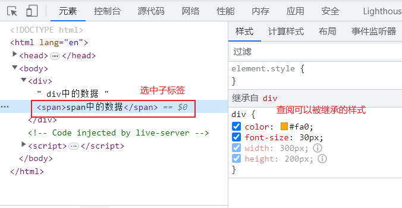
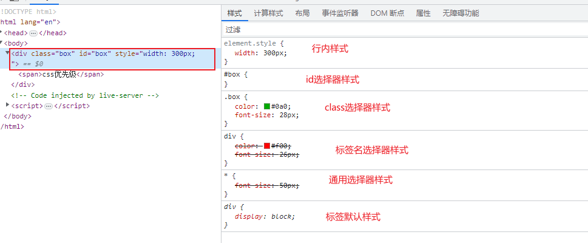

# 1-CSS介绍

## 1.1-web标准

W3C组织：他制定web领域中众多的标准。

关于网页的标准：一个网页（界面）应该由4部分组成：

* 网页内容：网页中需要展示的内容，它由后端程序提供（后期我们学习ajax技术，获取网页数据）
* 网页结构：它用于支撑网页基本布局，相当于网页的骨架（HTML标签）
* 网页样式：用于页面的美化（CSS技术）
* 网页行为：控制网页上的交互过程（主要JavaScript完成）

## 1.2-CSS介绍

CSS：层叠样式表。也是W3C给出的标准。用于修饰页面上的标签。

CSS经历三个版本：CSS1.0 、 CSS2.0、CSS3.0（最新版本的CSS）

HTML5和CSS3关系：没有任何关系。

在使用的过程中 HTML4+CSS3、HTML5+CSS3、HTML4+CSS2、HTML5+CSS2

# 2-css入门

## 2.1-css与html结合方式

CSS和HTML的结合由三种方式：

* 内联方式（行内样式）：将CSS代码直接书写在标签的style属性中（自己测试页面效果偶尔使用）

  ~~~html
  
css与html的结合方式，内联方式

  
css与html的结合方式，内联方式

  
css与html的结合方式，内联方式

  
css与html的结合方式，内联方式

  
css与html的结合方式，内联方式

  ~~~

* 内部样式：在head标签中，书写style标签，当前页面的css代码全部书写在style标签内部

  ~~~html
  <!DOCTYPE html>
  <html lang="en">
  <head>
      <meta charset="UTF-8">
      <meta http-equiv="X-UA-Compatible" content="IE=edge">
      <meta name="viewport" content="width=device-width, initial-scale=1.0">
      <title>Document</title>
      
  </head>
  <body>
      
好好学习

      
天天向上

      打酱油的
  </body>
  </html>
  ~~~

* 外部样式：将css代码书写在独立的css文件中（扩展名.css)，然后在需要使用css的页面上使用link标签引入

  ~~~html
  <!DOCTYPE html>
  <html lang="en">
  <head>
      <meta charset="UTF-8">
      <meta http-equiv="X-UA-Compatible" content="IE=edge">
      <meta name="viewport" content="width=device-width, initial-scale=1.0">
      <title>Document</title>
      <!-- 需要使用link标签引入外部的css文件 -->
      <link rel="stylesheet" href="./css/04.css">
  </head>
  <body>
      
好好学习

      
天天向上

      打酱油的
  </body>
  </html>
  ~~~

  ~~~css
  /* css文件 */
  div{
      color: red;
      font-size: 20px;
  }
  ~~~

## 2.2-CSS的语法

> css代码一般由三部分组成：选择器 、 样式名（属性名）、样式值（属性值）

~~~css
选择器{
    样式名:样式值;
    样式名:样式值;
    样式名:样式值;
}
~~~

> 如果使用的行内样式：不需要选择器，因为直接将样式书写在标签上。当前样式只能对当前标签有效。
>
> 如果是内部样式或者外部样式，才会使用选择器。

## 2.3-选择器

> VSCode 工具在开发中，经常需要安装一些插件，辅助开发
>
> open in browser ： 可以快速使用浏览器打开某个页面
>
> live server ： 以服务器方式快速打开某个网页

> 选择器：CSS中用来选择页面标签的一种规则。规则比较多的，后期慢慢学习。
>
> 最终通过选择器，找到页面对应的标签，然后将选择器中的css样式，作用到标签上。

### 2.3.1-通用选择器

~~~css
*{
    样式名：样式值;
    样式名：样式值;
    样式名：样式值;    
}
~~~

> 通用选择器：默认选中页面上的所有标签。在实际项目中这个选择器，基本不用。

~~~html
<!DOCTYPE html>
<html lang="en">
<head>
    <meta charset="UTF-8">
    <meta http-equiv="X-UA-Compatible" content="IE=edge">
    <meta name="viewport" content="width=device-width, initial-scale=1.0">
    <title>Document</title>
    
</head>
<body>
    
今天下雨！！！

    忘记带伞啦
    
好高兴~~~~

</body>
</html>
~~~

### 2.3.2-标签名选择器

> 语法格式：
>
> ~~~css
> 标签名{
>  样式名：样式值;
>  样式名：样式值;
>  样式名：样式值;   
> }
> ~~~

~~~html
<!DOCTYPE html>
<html lang="en">
<head>
    <meta charset="UTF-8">
    <meta http-equiv="X-UA-Compatible" content="IE=edge">
    <meta name="viewport" content="width=device-width, initial-scale=1.0">
    <title>Document</title>
    
</head>
<body>
    
今天下雨！！！

    忘记带伞啦
    
好高兴~~~~

</body>
</html>
~~~

### 3.3.3-类选择器

> 类选择器：class选择器，通过标签上的class属性值选中标签
>
> ~~~css
> .类名(class的属性值) {
>  样式名：样式值;
>  样式名：样式值;
>  样式名：样式值;    
> }
> ~~~

~~~html
<!DOCTYPE html>
<html lang="en">
<head>
    <meta charset="UTF-8">
    <meta http-equiv="X-UA-Compatible" content="IE=edge">
    <meta name="viewport" content="width=device-width, initial-scale=1.0">
    <title>Document</title>
    
</head>
<body>
    
今天下雨！！！

    忘记带伞啦
    
好高兴~~~~

</body>
</html>
~~~

### 3.3.4-ID选择器

选择器：css用于选择页面标签的一种规则。

通用选择器： *{   }

标签名选择器：标签名{   }

类选择器：.class属性值{  }

id选择器：需要给标签上添加一个id属性，通过id属性的值来选择标签。

~~~css
#id属性值{
    css属性名：属性值;
    css属性名：属性值;    
}
~~~

~~~html
<!DOCTYPE html>
<html lang="en">
<head>
    <meta charset="UTF-8">
    <meta http-equiv="X-UA-Compatible" content="IE=edge">
    <meta name="viewport" content="width=device-width, initial-scale=1.0">
    <title>Document</title>
    
</head>
<body>
    
好好学习，天天向上div

    
好好学习，天天向上div

    好好学习，天天向上span
    好好学习，天天向上span
</body>
</html>
~~~

> 注意：一般要求页面上标签的id属性值不能重复，因为后期学习JavaScript时，需要通过id属性值获取页面标签，如果id值重复，导致获取不到对应的标签。
>
> 在页面上如果需要处理样式，尽量使用class，不要使用id。

# 3-字体样式

## 3.1-文字颜色（color）

~~~css
字体样式：
	字体颜色color属性：书写有三种写法
		颜色英文单词 red、green、blue
		十六进制：三原色（红、绿、蓝）调配出各种各样的颜色
                红     绿     蓝
                00-FF  00-FF  00-FF
                常见的颜色写法：
                红色：#FF0000   #f00
                绿色：#00FF00   #0f0
                蓝色：#0000FF   #00f
                黑色：#000000   #000
                白色：#FFFFFF   #fff
       十进制：rgb(0-255 , 0-255 , 0-255)       
~~~

## 3.2-字体（font-family）

> 浏览器默认的字体：微软雅黑，如果设置的字体不存在，也会显示默认字体

~~~css
/* 字体：宋体，楷体，微软雅黑 */
font-family: 宋体 , 楷体 , 微软雅黑;
~~~

## 3.3-字体大小（font-size）

~~~css
/* 
	字体大小: 浏览器默认的字体大小16px
	浏览器有保护机制：字体默认最小为12px ， 设置为0的时候，文字被隐藏
		px：像素
		em：相对字体大小单位，如果当前所在的标签或父标签统一设置过默认字体大小
			那么1em，就是预先设置的大小，2em预先设置的两倍大小
		如果没有预先设置任何的字体大小，浏览器默认的16px
*/
font-size: 1.5em;
~~~

## 3.4-行高(line-height)

> 设置标签中一行文本数据的高度，文字默认会在设置的行高的垂直中间位置

~~~css
/* 行高 */
line-height: 30px;
~~~

## 3.5-字体加粗（font-weight）

> 设置字体的粗细：默认值100 | 200 | 300 | 400(normal) | 500 | 600(bold) | 700 | 800 | 900

~~~css
h1{
    /* 取消 标题标签的默认加粗 */
    font-weight: normal;
}
b{
    font-weight: normal;
}
~~~

## 3.6-文本装饰线(text-decoration)

~~~css
a{
	color: #444;
	/* 
    text-decoration: none;  表示没有任何装饰线
    text-decoration: underline; 数据设置下划线
    text-decoration: overline; 数据上划线
    text-decoration: line-through; 数据贯穿线（删除线）
	*/
	text-decoration: line-through;
}
~~~

# 4-文本样式

* text-align : 设置文本水平对齐方式，针对的块级标签【针对块标签有效】

  * left：默认值，左对齐
  * center：水平居中
  * right：右对齐

  ~~~html
  <!DOCTYPE html>
  <html lang="en">
  <head>
      <meta charset="UTF-8">
      <meta http-equiv="X-UA-Compatible" content="IE=edge">
      <meta name="viewport" content="width=device-width, initial-scale=1.0">
      <title>Document</title>
      
  </head>
  <body>
      
文本样式演示

      
文本样式演示

      
文本样式演示

      文字对齐方式
  </body>
  </html>
  ~~~

* text-indent ： 文本首行缩进，可以是负数，将文字移除到屏幕外面

  ~~~css
  /* 文本缩进 */
  font-size: 24px;
  /* text-indent: 32px; */
  /* em 设置缩进当前对应的字体大小的倍数 */
  text-indent: 2em;
  ~~~

* text-overflow : 设置一行文本超出指定宽度之后，显示 ...  ,需要配合两外一个样式一起使用.

  ~~~css
  /* 一行数据超出指定的宽度之后，显示 ... */
  text-overflow: ellipsis;
  
  /* 完成一行超出，显示... 必须先保证这一行的数据在屏幕，宽度发生变化的时候，不能换行 */
  white-space: nowrap;
  
  /* 当不换之后，也会出现横向滚动条，需要隐藏，不能让滚动条出来 */
  overflow: hidden;
  ~~~

* text-shadow ： 文本阴影

  ​	第一个值：阴影的水平位置

  ​	第二个值：阴影的垂直位置

  ​	第三个值：阴影的模糊度

  ​	第四个值：阴影的颜色

   ~~~html
  <!DOCTYPE html>
  <html lang="en">
  <head>
      <meta charset="UTF-8">
      <meta http-equiv="X-UA-Compatible" content="IE=edge">
      <meta name="viewport" content="width=device-width, initial-scale=1.0">
      <title>Document</title>
      
  </head>
  <body>
      好好学习天天向上
  </body>
  </html>
   ~~~

# 5-背景样式

## 5.1-设置块标签的宽度和高度

在css中， 只有块标签才能设置宽和高。行内标签无法设置，即使设置了也不会生效。

width ： 设置标签的宽度

height ：设置标签的高度

~~~css
.box{
    width: 500px;
    height: 200px;

}
/* 针对span设置宽度和高度无效的 */
span{
    width: 100px;
    height: 100px;
}
~~~

## 5.2-背景颜色

background-color ： 设置背景颜色

~~~css
width: 500px;
height: 300px;

/* 背景颜色 */
/* background-color: #f6f; */
/* background-color: rgb(255, 100, 255) */
background-color: rgba(255, 0, 255 , 0.5)
~~~

## 5.3-背景图片

* background-image:url( 图片的地址 )

* background-repeat ：设置背景图是否可以重复（平铺）
  * no-repeat ： 背景图不能重复（平铺）
  * repeat ： 水平和垂直方向都允许重复（平铺）
  * repeat-x ： 允许背景图 水平重复
  * repeat-y ： 允许背景图 垂直重复

* background-position ： 第一个位置控制水平   第二个位置控制垂直
  * 英文单词：水平：left  center  right     垂直 ： top  center  bottom
  * 百分比：20%  80%
  * 像素（主要用于背景图位置精确控制）

# 6-图片3px问题

在页面上处于一行不同的行内标签，他们默认都有自己在这一行底部的对齐方式（基准线对齐）。

图片3px问题：页面上的图片和文字，或者其他标签，他们默认的基准线不同，导致排列的时候，出现小的插口，这个小插口称为3px问题。

解决图片3px问题：vertical-align 更改这一行中的某个标签的对齐方式。

找到这一行中最高的那个标签，设置这一行中其他标签与当前这个标签的垂直方向上对齐方式。

* vertical-align ： 
  * top : 顶端对齐
  * middle ： 居中对齐
  * bottom ：底部对齐
  * baseline ： 默认的基准线对齐

# 7-复合属性的使用

> 在css中存在部分的复合属性，可以简化css代码，但是需要注意书写时的顺序问题

~~~html
<!DOCTYPE html>
<html lang="en">
<head>
    <meta charset="UTF-8">
    <meta http-equiv="X-UA-Compatible" content="IE=edge">
    <meta name="viewport" content="width=device-width, initial-scale=1.0">
    <title>Document</title>
    
</head>
<body>
    

</body>
</html>
~~~

# 8-盒子模型

## 8.1-什么是盒子模型

将页面上的每个标签看作一个盒子。每个盒子（标签）都可以去设置与盒子有关的样式。

整个页面，是不同的标签（盒子）嵌套，最终完成页面的结构布局，需要通过盒子相关样式属性，来合理的将不同的盒子放到页面不同位置，设置盒子自身的一些特征。

* 盒子相关的样式：
  * 边框：border
  * 内边距：padding
  * 大小：width、height
  * 外边距：margin

## 8.2-盒子大小

默认页面上的任何标签都可以给其设置大小，只有**块标签设置大小时是有效**的，行内标签设置大小是无效的。

* width：盒子的宽度
* height：盒子的高度

~~~css
/* 给div设置宽度和高度 */
width: 300px;
height: 200px;
background-color: #fa0;
~~~

* min-height：最小高度，当盒子中的内容，小于最小高度的时候，盒子以最小高度展示，如果内容高度超过盒子的高度，会以实际内容的高度为盒子的高度
* max-height：最大高度，当内容大于设置最大高度时，盒子中的内容会溢出，如果内容不足，盒子的高度会以实际内容的高度为准

## 8.3-版心概念

版心：在进行页面布局的时候，基于不同的网页大小，会设置核心的宽度。页面排版的核心宽度。

一般在pc端版心宽度：1000px、1200px、1400px

如果设置的版心为1400px，但是屏幕分辨率的宽度1366px，那么当前电脑打开这个网页，就会出现横向滚动条。

在实际项目中，通过会书写一个公共的css文件，其中书写当前项目所需要的公共css代码。

要求：一个网页，可以拥有纵向滚动条，但不能出现横向滚动条。

## 8.4-内边距

内边距：盒子边框与盒子中内容之间的缝隙。在css中使用padding表示。

* padding-top : 盒子上边框与内容之间的距离
* padding-right：盒子右边框与内容之间的距离
* padding-bottom：盒子下边框与内容之间的距离
* padding-left：盒子左边框与内容之间的距离
* padding : 它是复合属性，简化内边距的书写
  * 一个值：4个内边距都是这个值
  * 两个值：第一个值：上下内边距，第二个值：表示左右内边距
  * 三个值：第一个值：上内边距，第二个值：表示左右内边距 ， 第三个值：表示下内边距
  * 四个值：第一个值：上内边距，第二个值：表示右内边距 ， 第三个值：表示下内边距 ， 第四个值：表示左边内边距

~~~html
<!DOCTYPE html>
<html lang="en">
<head>
    <meta charset="UTF-8">
    <meta http-equiv="X-UA-Compatible" content="IE=edge">
    <meta name="viewport" content="width=device-width, initial-scale=1.0">
    <title>Document</title>
    
</head>
<body>
    
内边距：盒子边框与盒子中内容之间的缝隙，内边距：

</body>
</html>
~~~

## 8.5-外边距

外边距：盒子与盒子之间的距离。

* margin表示盒子的外边距：
  * margin-top ： 上边的外边距
  * margin-right ： 右边的外边距
  * margin-bottom ： 下边的外边距
  * margin-left： 左边的外边距

* margin 复合属性：
  * 一个值：4个外边距都是这个值
  * 两个值：第一个值：上下外边距，第二个值：表示左右外边距
  * 三个值：第一个值：上外边距，第二个值：表示左右外边距 ， 第三个值：表示下外边距
  * 四个值：第一个值：上外边距，第二个值：表示右外边距 ， 第三个值：表示下外边距 ， 第四个值：表示左边外边距

~~~html
<!DOCTYPE html>
<html lang="en">
<head>
    <meta charset="UTF-8">
    <meta http-equiv="X-UA-Compatible" content="IE=edge">
    <meta name="viewport" content="width=device-width, initial-scale=1.0">
    <title>Document</title>
    
</head>
<body>
    

</body>
</html>
~~~

## 8.6-边框

border：用于给盒子添加边框线

~~~html
<!DOCTYPE html>
<html lang="en">
<head>
    <meta charset="UTF-8">
    <meta http-equiv="X-UA-Compatible" content="IE=edge">
    <meta name="viewport" content="width=device-width, initial-scale=1.0">
    <title>Document</title>
    
</head>
<body>
    

</body>
</html>
~~~

> 注意盒子有坑：
>
> 1、宽度和高度只能设置给块级标签
>
> 2、内外边距：在设置的时候，块级上右下左都可以生效，而行内标签只有左右生效，上下无效（难点，后续要加强）。

# 9-标准模式与怪异模式

编写的HTML和css代码，最终都需要交给浏览器解析执行。浏览器内置html的解析引擎、CSS解析引擎、V8JS解析引擎。

当浏览器加载html代码的时候，遇到html代码启动html的解析引擎，去识别每个标签，将标签解析完成之后，展示在浏览器窗口上。

在解析的过程中，遇到css代码，启动css解析引擎，将不同的选择器，选中的标签，给他作用对应的css样式。

标准模式和怪异模式，都是浏览器解析html代码一种方式。

标准模式：书写的html，如果书写声明，<!DOCTYPE html>  这时浏览器就会严格按照声明对应的html版本去解析其中的每个标签。

怪异模式：书写html代码的时候，故意不写文档声明，这时IE6、7、8就会启动非标准模式解析html标签和css样式。

**标准模式：盒子的总大小 = 盒子边框 + 内边距 + 其中内容(设置宽度和高度)**

**怪异模式：盒子的总大小 = 设置宽度和高度 = 盒子边框 + 内边距 + 内容（区域会被压缩）**

总结：在css3中，标准模式与怪异模式切换通过css样式处理

* box-sizing:
  * border-box ： 怪异盒子（边框盒子），设置的width和height 为盒子总大小
  * content-box ： 标准盒子（内容盒子），设置的width和height 为仅仅只是盒子中内容的大小

# 10-其他样式

## 10.1-数据溢出处理

* overflow：
  * **hidden： 超出之后的内容会被隐藏**
  * visible： 默认值，超出可见
  * **auto：自动，如果内容超出，就会显示滚动条**
  * scroll ：默认会显示滚动条区域

* overflow-y：也有上面的四个值，主要设置纵向滚动条（后期移动端会使用）
* overflow-x：也有上面的四个值，设置横向滚动条，使用频率不多。

~~~html
<!DOCTYPE html>
<html lang="en">
<head>
    <meta charset="UTF-8">
    <meta http-equiv="X-UA-Compatible" content="IE=edge">
    <meta name="viewport" content="width=device-width, initial-scale=1.0">
    <title>Document</title>
    
</head>
<body>
    
检指定高度及宽度时如何管理内容索或设置当

</body>
</html>
~~~

## 10.2-显示与隐藏

* display ： 可以完成标签在页面上的显示与隐藏（后期它还有flex等属性值）
  * none ： 隐藏当前的某个标签。
  * inline ： 让标签以行内标签方式显示。
  * block ： 让标签以块标签方式显示。
  * inline-block ： 让标签以行内块标签方式显示。

~~~html
<!DOCTYPE html>
<html lang="en">

<head>
    <meta charset="UTF-8">
    <meta http-equiv="X-UA-Compatible" content="IE=edge">
    <meta name="viewport" content="width=device-width, initial-scale=1.0">
    <title>Document</title>
    
</head>

<body>
    

        <a href="#">百度</a>
    

    

    

    

</body>

</html>
~~~

## 10.3-列表样式

ol、ul默认的li列表项前面符号，可以使用 list-style:none  清除列表前面默认的符号

## 10.4-鼠标样式

cursor:pointer   ; 鼠标移动到上面显示一个小手          

# 11-浮动布局

## 11.1-布局

布局：针对UI设计图 ，需要将设计图还原成对应的网页。在还原的过程中，基于设计图，布局网页界面（使用布局标签div、header、nav、aside、main、article、section、footer），从整体，到局部，最后到细节。

## 11.2-浮动布局

把当前整个页面看成一个游泳池，

设置任何一个盒子的背景，相当于操作泳池的池底，

设置文本，文本样式，相当于操作泳池的水面

背景层：池底

前景层：水面

浮动：让页面的某个盒子（标签）从池底浮动到水面上。相当于这个盒子它的背景就浮动到水面上，会与其他抢前景层的位置。

浮动样式属性：

* float ：
  * left ： 左浮动
  * right ： 右浮动

盒子一旦浮动了，只要一行能够放下，所有盒子都浮动到一行。浮动的盒子，会自动的变成行内块标签。

## 11.3-清除浮动

当在页面中，前面的标签浮动，后面的标签会钻到前面标签的下面。如果后面标签，不管前面是否浮动，都不能改变自己在页面的布局位置。这时需要手动清除浮动。

* clear ： 清除浮动
  * left ： 清除左边的浮动
  * right ：清除右边的浮动
  * both ： 清除两侧的浮动

~~~html
<!DOCTYPE html>
<html lang="en">
<head>
    <meta charset="UTF-8">
    <meta http-equiv="X-UA-Compatible" content="IE=edge">
    <meta name="viewport" content="width=device-width, initial-scale=1.0">
    <title>Document</title>
    
</head>
<body>
    

    

    

</body>
</html>
~~~

## 11.4-外边距塌陷问题

浮动带来的i的一个问题：页面上前面的盒子浮动，后面的盒子会往前面盒子下面钻，可以使用clear清除浮动，保证盒子不会钻到其他浮动盒子下面。

浮动带来的另外一个问题：外边距塌陷，后面的盒子，在计算外边距的时候，由于前面盒子是浮动的，根本找不到计算的盒子边界。针对这种问题，解决方案右4种。

* 给浮动的盒子添加父标签，给父标签设置固定高度。【缺陷：需要知道当前父盒子的固定高度，如果内容是自动撑高的，那么高度就不能写死】

  ~~~html
  

      <aside class="left">左边</aside>
      <main class="content">主要内容</main>
      <aside class="right">右边</aside>
  

  ~~~

  ~~~css
  .cf{
      height: 300px;
  }
  ~~~

* 给浮动的盒子添加父标签，给父盒子设置overflow:hidden。【设置超出隐藏的目的根本不是让内容超出之后隐藏，而是让浏览器根据父标签中的子标签，给父标签算实际高度】

  ~~~html
  

      <aside class="left">左边</aside>
      <main class="content">主要内容</main>
      <aside class="right">右边</aside>
  

  ~~~

  ~~~css
  .cf{
      /* height: 300px; */
      overflow: hidden;
  }
  ~~~

* 给浮动的标签后面添加一个空的div，在这个div上使用clear：both清除浮动。【这个空的div没有其他的任何作用，只是为了满足清除浮动，保证后面的标签可以正常的布局】

  ~~~html
  <!DOCTYPE html>
  <html lang="en">
  <head>
      <meta charset="UTF-8">
      <meta http-equiv="X-UA-Compatible" content="IE=edge">
      <meta name="viewport" content="width=device-width, initial-scale=1.0">
      <title>Document</title>
      
  </head>
  <body>
      <section>
          
浮动布浮动布局介绍：浮动是将页面的某个盒子在页面进行局介绍

          
浮动布局浮动布局介绍浮动布局

         

      </section>
  
      
浮动布局介绍：浮动是将页面的某个盒子在页面进行向左，或者向右的位置移动。最终达到页面布局的效果浮动布局介绍：浮动是将页面的某个盒子在页面进行向左，或者向右的位置移动。最终达到页面布局的效果

  </body>
  </html>
  ~~~

* 使用伪元素(假的标签) ::after 来代替 空div，解决浮动问题。【伪元素：通过CSS制作出来的假标签，但是它可以在页面充当标签的效果。默认是一个行内标签】

  ~~~html
  <!DOCTYPE html>
  <html lang="en">
  <head>
      <meta charset="UTF-8">
      <meta http-equiv="X-UA-Compatible" content="IE=edge">
      <meta name="viewport" content="width=device-width, initial-scale=1.0">
      <title>Document</title>
      
  </head>
  <body>
      <section class="cf">
          
浮动布浮动布局介绍：浮动是将页面的某个盒子在页面进行局介绍

          
浮动布局浮动布局介绍浮动布局

      </section>
  
      
浮动布局介绍：浮动是将页面的某个盒子在页面进行向左，或者向右的位置移动。最终达到页面布局的效果浮动布局介绍：浮动是将页面的某个盒子在页面进行向左，或者向右的位置移动。最终达到页面布局的效果

  </body>
  </html>
  ~~~

# 12-css样式书写顺序

**css书写顺序：**

1. 位置元素定位；
2. 自身属性；
3. 文字样式；
4. 文本属性；
5. c3中新增属性.

> 位置元素有：position–定位属性，float --浮动属性，overflow --溢出属性，z-index–显示层级问题；
>
> 自身元素有：宽高–width、height，内外的间隔–padding、margin，背景颜色–background等；
>
> 文字样式有：字体 – font-family，字体大小–font-size，字体样式–font-style等；
>
> 文本属性有：对其方式–text-align，换行–text-wrap，文本位置–text-indent等
>
> C3新增属性：盒阴影–box-shadow，盒变形–transform，盒圆角–border-radius等

# 13-选择器补充

## 13.1-组合选择器

> 在页面上，有时出现不同的选择器，选中不同的标签，这些被选中的标签需要使用相同的样式。

组合选择器(并列、分组)：多个选择器之间使用**逗号**隔开，他们可以使用相同的样式

~~~css
选择器,选择器,选择器{
    css属性名：属性值;
    css属性名：属性值;        
}
~~~

~~~html
<!DOCTYPE html>
<html lang="en">
<head>
    <meta charset="UTF-8">
    <meta http-equiv="X-UA-Compatible" content="IE=edge">
    <meta name="viewport" content="width=device-width, initial-scale=1.0">
    <title>Document</title>
    
</head>
<body>
    G
    o
    o
    g
    l
    e
</body>
</html>
~~~

## 13.2-伪类选择器

### 13.2.1-伪类介绍

伪类：它不是页面上真正存在的class名字，它表示的是页面上标签的一种状态。可以根据标签的不同状态来选中标签，基于某个状态，给标签 设置对应的样式。

~~~css
选择器:状态{
    css属性名：属性值;
    css属性名：属性值;      
}
~~~

~~~html
<!DOCTYPE html>
<html lang="en">
<head>
    <meta charset="UTF-8">
    <meta http-equiv="X-UA-Compatible" content="IE=edge">
    <meta name="viewport" content="width=device-width, initial-scale=1.0">
    <title>Document</title>
    
</head>
<body>
    <a href="https://www.baidu.com">百度</a>
    <a href="https://www.jd.com">京东</a>
    <a href="https://www.taobao.com">淘宝</a>
    <a href="https://www.qq.com">腾讯</a>
</body>
</html>
~~~

> 常用的伪类选择器（标签的状态，主要针对a标签）：
>
> :link : 鼠标还没有点击状态
>
> :visited: 鼠标点击后的状态
>
> :hover : 鼠标悬停（移入）状态
>
> :active: 鼠标点击瞬间状态
>
> L   V   H   A  
>
> 部分网站，他们会将link与visited设置成相同的样式效果

### 13.2.2-伪类练习

~~~html
<!DOCTYPE html>
<html lang="en">
<head>
    <meta charset="UTF-8">
    <meta http-equiv="X-UA-Compatible" content="IE=edge">
    <meta name="viewport" content="width=device-width, initial-scale=1.0">
    <title>Document</title>
    
</head>
<body>
    
<a href="#">中国港口空集装箱数量增加，引发大家对外贸担忧，海关总署</a>

    
<a href="#">俄罗斯和中国——面向未来的伙伴关系</a>

    
<a href="#">后续来了！沙伊在北京历史性和解后，伊朗总统将访问沙特</a>

    
<a href="#">将访大陆，马英九是自李登辉以来唯一没来过大陆的台湾地区</a>

    
<a href="#">散布明星陈某某隐私5人被拘 此前某博主发布疑似陈飞宇亲密</a>

    可以给所有标签设置

</body>
</html>
~~~

## 13.3-伪元素

伪元素：通过CSS给标签中添加假的标签，比如::after、::before等。然后还可以通过CSS给这些动态添加的标签去设置样式。

| E:first-letter/E::first-letter | CSS1/3 | 设置对象内的第一个字符的样式。                               |
| ------------------------------ | ------ | ------------------------------------------------------------ |
| E:first-line/E::first-line     | CSS1/3 | 设置对象内的第一行的样式。                                   |
| E:before/E::before             | CSS2/3 | 设置在对象前（依据对象树的逻辑结构）发生的内容。用来和content属性一起使用 |
| E:after/E::after               | CSS2/3 | 设置在对象后（依据对象树的逻辑结构）发生的内容。用来和content属性一起使用 |
| E::placeholder                 | CSS3   | 设置对象文字占位符的样式。                                   |
| E::selection                   | CSS3   | 设置对象被选择时的颜色。                                     |

~~~html
<!DOCTYPE html>
<html lang="en">
<head>
    <meta charset="UTF-8">
    <meta name="viewport" content="width=device-width, initial-scale=1.0">
    <title>Document</title>
    
</head>
<body>
    
12321321321

    
12321321321

    
12321321321

    演示伪对象选择器
    
演示伪对象选择器演示伪对象选择器演示伪对象选择器演示伪对象选择器演示伪对象选择器演示伪对象选择器演示伪对象选择器演示伪对象选择器演示伪对象选择器演示伪对象选择器演示伪对象选择器演示伪对象选择器演示伪对象选择器演示伪对象选择器演示伪对象选择器演示伪对象选择器演示伪对象选择器演示伪对象选择器演示伪对象选择器演示伪对象选择器演示伪对象选择器演示伪对象选择器演示伪对象选择器演示伪对象选择器演示伪对象选择器演示伪对象选择器演示伪对象选择器演示伪对象选择器演示伪对象选择器

    <input type="text" placeholder="请输入用户名">
</body>
</html>
~~~

# 14-css优先级  

## 14.1-css的继承

css的继承：在css中，子标签可以去使用父标签的样式。子标签继承到了父标签的样式。

在css中不是所有的样式都可以被继承。

CSS中可以被继承的样式：

* 文字样式：color、font-size、font-weight、font-family、font-style
* 文本样式：line-height、text-align、text-indent、letter-spacing、word-spacing
* 列表样式：list-style

css的样式继承可以通过浏览器的样式查阅

**注意：针对a标签，它的文字样式无法继续到父标签。**

## 14.2-css优先级【精通】

优先级：css的选择器，本身存在一定的优先级，高优先级的选择器，它的样式优先被使用。会覆盖低优先级的样式。

> css优先级的顺序
>
> ! important   >  行内样式  >  **id选择器  >  class选择器   > 标签名**  >  通用选择器  >  继承 > 默认
>
> 

~~~html
<!DOCTYPE html>
<html lang="en">
<head>
    <meta charset="UTF-8">
    <meta http-equiv="X-UA-Compatible" content="IE=edge">
    <meta name="viewport" content="width=device-width, initial-scale=1.0">
    <title>Document</title>
    
</head>
<body>
    

        css优先级
    

</body>
</html>
~~~

## 14.3-css的权重(权值)计算

~~~css
/* 多层级，样式怎么判断 */
div .box2 {
    color: #0a0;
}
.box span {
    color: #f00;
}
~~~

~~~html
<body>
    

        
            猜猜文字啥颜色
        
    

</body>
~~~

> 多层级的选择器，优先级 需要给不同的层级的选择器假设一个css的权重数值(这个值是程序员自己假设的，不是官方给出的)
>
> 行内样式：权值1000
>
> id选择器：权值100
>
> class选择器：权值10
>
> 标签名：权值1
>
> 将这些权值使用到对应的层级样式中，权值加起来越大的数字，优先级越高。

**运用场景**：用于大型项目层级比较深时处理继承问题

# 15-css定位技术

## 15.1-css的定位介绍

* 广义上的定位：在css中，与位置有关系的都可以称为定位。例如：浮动，内边距，外边距等
* 狭义上的定位：使用css中的position属性去控制标签的位置。

## 15.2-position属性完成定位

~~~css
position ： 主要有三个重要的值
 absolute: 绝对定位,基于父标签进行定位
 fixed ：固定定位，基于浏览器边缘定位
 relative ： 相对定位，基于自己原有位置定位
~~~

* absolute ： 标签会脱离原来html文件结构（脱离文档流）,会让出自己原来的位置，定位的方位属性控制具体的位置。

  在定位的时候，盒子会先找父标签，如果父标签有定位设置，会基于父标签来定位，如果父标签没有定位属性，继续往外找，直到最后，会以浏览器的边沿为定位的依据。

  ~~~html
  <!DOCTYPE html>
  <html lang="en">
  <head>
      <meta charset="UTF-8">
      <meta http-equiv="X-UA-Compatible" content="IE=edge">
      <meta name="viewport" content="width=device-width, initial-scale=1.0">
      <title>Document</title>
      
  </head>
  <body>
      

      <h2>我是打酱油的，用于测试定位</h2>
      <h2>我是打酱油的，用于测试定位</h2>
      <h2>我是打酱油的，用于测试定位</h2>
  </body>
  </html>
  ~~~

* 固定定位：fixed，脱离html的结构（脱离文档流）,让出自己的位置，通过定位的方位属性控制位置，盒子会被固定到屏幕上，不会随着滚动条的移动而改变自己在屏幕上的位置。**它是基于浏览器的边沿定位**。

  ~~~css
  .box{
      /* 位置书写在最前面 */
      position: fixed;
      left: 0;
      top: 0;
      width: 200px;
      height: 150px;
      background-color: deeppink;
  }
  ~~~

* 相对定位：relative，不会脱离html文档结构（不脱离文档流），不会让出自己原来所在的布局位置，在使用定位属性的时候，都是基于自己原有布局时所在的位置进行定位。

  ~~~css
  .box{
      /* 位置书写在最前面 */
      position: relative;
      left: 0;
      top: 0;
      width: 200px;
      height: 150px;
      background-color: deeppink;
  }
  ~~~

## 15.3-定位方位控制属性

* top ： 设置盒子距离顶部的位置
* right ：  设置盒子距离右边的位置
* bottom ：  设置盒子距离底部的位置
* left ：  设置盒子距离左边的位置

## 15.4-定位练习

### 15.4.1-css3中的圆角

圆角：在css3中，添加border-radius属性，主要用于设置盒子的四个角为圆角。

~~~html
<!DOCTYPE html>
<html lang="en">
<head>
    <meta charset="UTF-8">
    <meta http-equiv="X-UA-Compatible" content="IE=edge">
    <meta name="viewport" content="width=device-width, initial-scale=1.0">
    <title>Document</title>
    
</head>
<body>
    

    

    

    

    

</body>
</html>
~~~

### 15.4.2-八卦图——子绝父相

子绝父相：子标签采用绝对定位，父标签使用相对定位（其实只要父标签使用position即可）。

~~~html
<!DOCTYPE html>
<html lang="en">
<head>
    <meta charset="UTF-8">
    <meta http-equiv="X-UA-Compatible" content="IE=edge">
    <meta name="viewport" content="width=device-width, initial-scale=1.0">
    <title>Document</title>
    
</head>
<body>
    

        

        

        

        

        

        

    

</body>
</html>
~~~

### 15.4.3-将一个盒子放到屏幕最中间

~~~html
<!DOCTYPE html>
<html lang="en">
<head>
    <meta charset="UTF-8">
    <meta http-equiv="X-UA-Compatible" content="IE=edge">
    <meta name="viewport" content="width=device-width, initial-scale=1.0">
    <title>Document</title>
    
</head>
<body>
    

</body>
</html>
~~~

~~~html
<!DOCTYPE html>
<html lang="en">
<head>
    <meta charset="UTF-8">
    <meta http-equiv="X-UA-Compatible" content="IE=edge">
    <meta name="viewport" content="width=device-width, initial-scale=1.0">
    <title>Document</title>
    
</head>
<body>
    

</body>
</html>
~~~

## 15.5-层级

z-index ： 必须是盒子已经使用position进行定位，然后才能使用z-index进行层级的设置。

数字越大，当前这个盒子就会在最上面。

~~~html
<!DOCTYPE html>
<html lang="en">
<head>
    <meta charset="UTF-8">
    <meta http-equiv="X-UA-Compatible" content="IE=edge">
    <meta name="viewport" content="width=device-width, initial-scale=1.0">
    <title>Document</title>
    
</head>
<body>
    

    

    

</body>
</html>
~~~

# 16、弹性盒子

## 16.1、弹性盒子（布局）介绍

CSS3中针对浮动布局进行优化，提出弹性盒子布局。2009年C3提出，经历三个版本。

弹性盒子：flex布局。

经历三个版本：box、flexbox、flex

~~~html
<!DOCTYPE html>
<html lang="en">

<head>
    <meta charset="UTF-8">
    <meta http-equiv="X-UA-Compatible" content="IE=edge">
    <meta name="viewport" content="width=device-width, initial-scale=1.0">
    <title>Document</title>
    
</head>

<body>
    

        
1

        
2

        
3

    

</body>

</html>
~~~

## 16.2、弹性盒子的相关概念

* 容器：被设置为弹性盒子（display：flex）那个标签，称为弹性容器。注意：单标签无法设置
* 项目：放在容器中的其他标签
* 基于弹性盒子的其他名词
  * 主轴：用来设置容器中项目的排列方向，默认方向是：横向（水平方向），可以修改。
  * 主轴起点：默认是主轴的最左侧
  * 主轴终点：默认是主轴的最右侧
  * 侧轴：与主轴正好垂直，方向默认是纵向，侧轴不能设置方向，由主轴的方向来决定。
  * 侧轴起点：默认盒子的顶部
  * 侧轴终点：默认盒子的底部

## 16.3、在容器上设置属性

* display：flex 将当前的盒子设置为弹性盒子（容器）
  * display：box
  * display：flexbox
  * display：flex

* flex-direction：设置主轴的方向
  * **row：主轴为水平（横向），默认从左往右**
  * row-reverse：主轴为水平方向，默认从右往左
  * **column：设置主轴为纵向。从上往下**
  * column-reverse：反正主轴中项目的方向，从下往上

* flex-wrap: 设置容器的项目是否换行
  * nowrap ： 不允许换行，项目的宽度会根据当前容器的宽度进行计算
  * wrap ： 允许换行
  * wrap-reverse：换行切反转
* justify-content: 设置容器中的内容（项目在主轴）排列方式
  * flex-strat|left：设置项目左对齐，基于主轴的起点对齐
  * flex-end|right：设置项目右对齐，基于主轴的终点对齐
  * center：水平居中对齐
  * **space-between ： 两端对齐，中间的距离平均分配**
  * **space-around ： 环绕对齐，每个项目左右固定的外边距**
  * **space-evenly：平均分配，每个项目之间的间距相等**
* align-items：设置容器中的内容（项目）在侧轴方向上的排列方式（区分行）
  * flex-start：以侧轴的起点对齐
  * flex-end：以侧轴的终点对齐
  * **center：以侧轴中间对齐**
* align-content: 设置容器中的内容（项目）在侧轴方向上的排列方式（不区分行）
  * flex-start：以侧轴的起点对齐
  * flex-end：以侧轴的终点对齐
  * **center：以侧轴中间对齐**

~~~html
<!DOCTYPE html>
<html lang="en">

<head>
    <meta charset="UTF-8">
    <meta http-equiv="X-UA-Compatible" content="IE=edge">
    <meta name="viewport" content="width=device-width, initial-scale=1.0">
    <title>Document</title>
    
</head>

<body>
    

        
1

        
2

        
3

        
4

        
5

    

</body>

</html>
~~~

## 16.4、在项目上设置属性

容器中的每个项目，可以设置自己的实际的宽和高，但是有时需要根据水平或者垂直方向上剩余的空间来计算某个项目自己的宽度和高度。需要使用项目的伸缩比去计算

剩余空间 = 水平或垂直方向总宽度 - 每个项目宽度 - 每个项目边框 - 每个项目的外边距

伸缩比：所有项目设置伸缩比累加起来， 剩余空间 * 设置的伸缩比值 / 所有伸缩比和

* **flex-grow: 项目当前占据的位置扩展比例**
* order ： 设置项目顺序，默认值 0 ，可以设置正数，也可以设置负数。按照数值大小排列
* align-self：设置某个项目自己在侧轴对齐方式

~~~html
<!DOCTYPE html>
<html lang="en">

<head>
    <meta charset="UTF-8">
    <meta http-equiv="X-UA-Compatible" content="IE=edge">
    <meta name="viewport" content="width=device-width, initial-scale=1.0">
    <title>Document</title>
    
</head>

<body>
    

        
1

        
2

        
3

    

</body>

</html>
~~~

# 17-盒子居中(4种方式)

~~~html
<!DOCTYPE html>
<html lang="en">

<head>
    <meta charset="UTF-8">
    <meta http-equiv="X-UA-Compatible" content="IE=edge">
    <meta name="viewport" content="width=device-width, initial-scale=1.0">
    <title>Document</title>
    
</head>

<body>
    

</body>

</html>
~~~

# 18、web图标字体

web字体：在页面像使用普通的文字一样去使用图标。图标的大小，颜色等都可以通过CSS文字和文本样式去设置。

编码表：将生活中的文字符号，通过表格（编码表），给出对应的编号，编号可以转成二进制最终存储在计算机中。

我们使用阿里的矢量图：

1、注册账号，登录

2、搜索对应的图标，添加到购物车中

3、将购物车中图标添加到一个项目中，如果没有对应的项目，可以新建

4、在项目中找到对应的图标，修改class名称

5、下载至本地，解压后，修改文件夹的名称fonts

6、将文件夹复制到项目中

7、在项目中引入iconfont的css文件

8、在需要图标的位置上使用span标签引入字体图标

